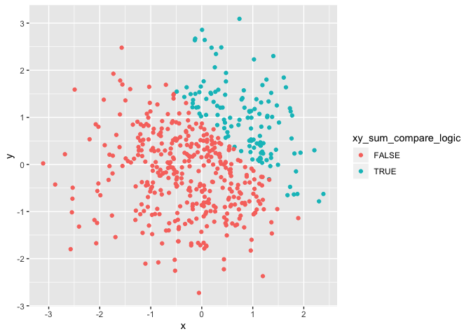
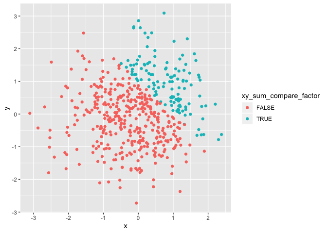

P8105 Homework 1
================
Junxian Chen (jc5314)
09-14-2019

# Problem 1

### 1\. Create a data frame called `p1_df`:

``` r
library(tidyverse)

# data frame for problem 1
p1_df = tibble(                  
  norm_samp = rnorm(8),
  norm_samp_pos = norm_samp > 0,
  character_vector = LETTERS[1:8],
  factor_level = gl(3, 3, length = 8, labels = c("X", "Y", "Z"))
)
```

### 2\. Take the mean of each variable in the data frame `p1_df`:

``` r
mean(pull(p1_df, norm_samp))
## [1] 0.6585602
mean(pull(p1_df, norm_samp_pos))
## [1] 0.625
mean(pull(p1_df, character_vector))
## Warning in mean.default(pull(p1_df, character_vector)): argument is not
## numeric or logical: returning NA
## [1] NA
mean(pull(p1_df, factor_level))
## Warning in mean.default(pull(p1_df, factor_level)): argument is not numeric
## or logical: returning NA
## [1] NA
```

When trying to take the mean of each variable in the data frame, the
first two variables work and give numeric answers. While the third and
forth variable do not work and give out warning messages and `NA` as
result.

### 3\. Convert variables from one type to another:

Apply the `as.numeric` function to the logical, character, and factor
variables:

``` r
as.numeric(pull(p1_df, norm_samp_pos))
as.numeric(pull(p1_df, character_vector))
as.numeric(pull(p1_df, factor_level))
```

When applying the `as.numeric` function to the logical variable, the
`TURE` in the logical variable is converted to `1` and `FALSE` is
converted to `2`. For the character variable, the function does not work
and give `NA` as results. For the factor variable, factors are converted
to numbers starting from `1` and the number of same factors are the
same.

I think this is because the logical and factor variables can be
considered as categorical variables. Thus, they can be converted to
certain numbers with different values and still represent different
categories. However, the character variable cannot be divied into
different categories and thus it cannot be converted to any certain
number. I think this helps explain the reason why logical variable can
take the mean but character variable cannot. But it does not explain why
the factor varible cannot take the mean
neither.

``` r
# Convert the logical vector to numeric, and multiply the random sample by the result:

as.numeric(pull(p1_df, norm_samp_pos)) * pull(p1_df, norm_samp)
## [1] 2.3490977 0.0000000 0.6957339 1.3614631 0.0000000 0.0000000 1.0192251
## [8] 1.2410935

# Convert the logical vector to a factor, and multiply the random sample by the result:

factor(pull(p1_df, norm_samp_pos)) * pull(p1_df, norm_samp)
## Warning in Ops.factor(factor(pull(p1_df, norm_samp_pos)), pull(p1_df,
## norm_samp)): '*' not meaningful for factors
## [1] NA NA NA NA NA NA NA NA

# Convert the logical vector to a factor and then convert the result to numeric, and 
# multiply the random sample by the result:

factor_samp_pos = factor(pull(p1_df, norm_samp_pos))
as.numeric(factor_samp_pos) * pull(p1_df, norm_samp)
## [1]  4.6981954 -0.4414847  1.3914678  2.7229262 -0.8025544 -0.1540928
## [7]  2.0384502  2.4821870
```

# Problem 2

### 1\. Creat a data frame called `p2_df`:

``` r
# data frame for problem 2
p2_df = tibble(                  
  x = rnorm(500),
  y = rnorm(500),
  xy_sum_compare_logic = x + y > 1,
  xy_sum_compare_numeric = as.numeric(xy_sum_compare_logic),
  xy_sum_compare_factor = factor(xy_sum_compare_logic)
)
```

Dataset description:

The dataset `p2_df`contains 500 rows and 5 columns. For the variable `x`
in dataset, the mean is -0.0581569, the median is -0.0250602 and the
standard deviation is 1.0320743. The proportion of cases for which `x +
y > 1` is 23.8%.

### 2\. Make a scatterplot of `y` vs `x`:

Make the
plots:

``` r
plot_1 = ggplot(p2_df, aes(x = x, y = y, color = xy_sum_compare_logic)) + geom_point()

plot_2 = ggplot(p2_df, aes(x = x, y = y, color = xy_sum_compare_numeric)) + geom_point()

plot_3 = ggplot(p2_df, aes(x = x, y = y, color = xy_sum_compare_factor)) + geom_point()
```

Show the plots:

``` r
plot_1
```

<!-- -->

``` r
plot_2
```

<!-- -->

``` r
plot_3
```

<!-- -->

Comments on the color scales:

Although the points in these three scatterplots are colored by different
types of variable (logical, numeric, factor), the color scales are the
same. Points are sepereted into two different colors approximately by a
linear line y = -x + 1, which accords with the criterion (`x + y > 1`)
of setting the logical variable.

### 3\. Save the first scatterplot:

``` r
ggsave('./hw1_scatterplot.png', plot = plot_1)
```
